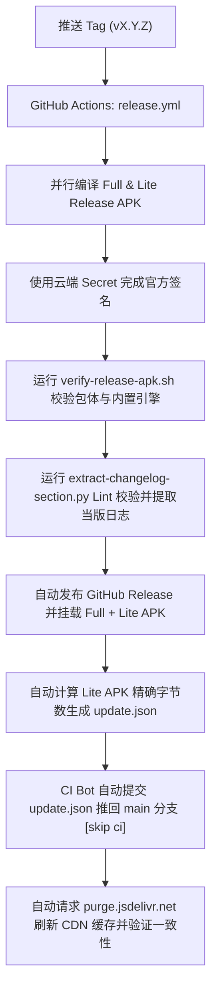

# 发版流程（Release Checklist）

> **给 AI 工具与维护者：** 本仓库采用 **Tag 驱动的全自动云端闭环流水线（Tag-Driven Release CI）**。发版时只需**更新日志、升版本号并推送 Tag**，云端 GitHub Actions 会自动完成构建、签名、校验、发布 GitHub Release、回填 `update.json` 与 CDN 缓存刷新。

远程仓库：`qpst4/XGesture`

---

## 产物说明

| 产物 | 文件名 | 用途 |
|------|--------|------|
| **Full 胖包** | `xgesture-{版本}-full.apk` | GitHub Release；新用户装完即用（内置完整 Native 引擎包） |
| **Lite 轻量包** | `xgesture-{版本}-lite.apk` | **应用内更新**默认指向此包（轻量，不含内置引擎） |
| **引擎 zip** | `*-engine-arm64-vN.zip` | **仅引擎变更时**上传；纯 App 发版不必每次附带 |

`applicationId` 始终为 `com.slideindex.app`，full / lite 可互相覆盖安装。

---

## 发版操作（极简 3 步）

### 1. 收集当版完整日志（必须）

**禁止仅盲目拷贝 `CHANGELOG.md` 中现有的 `[Unreleased]` 暂存文字。** 必须通过 `git log` 与文件 Diff 主动审计自上次 Tag 发版以来的所有真实变更：

```bash
# 查出上一个发版 Tag
last_tag=$(git describe --tags --abbrev=0)

# 1. 输出自上次发版以来的所有 Commit 变更
git log ${last_tag}..HEAD --oneline

# 2. 检查新增文件与配置类（防止遗漏全新 Feature/模式）
git diff ${last_tag}..HEAD --name-only --diff-filter=A
```

**审计铁律：** 
- 凡在两次 Release 之间**新增了 ViewModel/Enum/配置类/组件**，代表引入了全新的功能或模式，**100% 必须作为 `Added` 新功能列出**，绝不可仅作为 Bug 修复简写。
- 汇总审计所有 Commit 与新增文件后，归纳整理出当版完整的 `Added` / `Changed` / `Fixed` 清单，写入 `CHANGELOG.md` 的 `## [{版本号}] - YYYY-MM-DD` 章节中。
- **同一版必须再写一份英文段落，放进 `CHANGELOG.en.md`**：版本标题与 `### Added` / `### Changed` / `### Fixed` 分组名与中文文件逐字对应，条目一一对应（见下方「1.5 双语更新日志」）。

**文风（硬要求）：** 日志是给用户看的差异清单，不是调试记录，也不是 Commit message 的压缩版。

- 每条一行，动词开头，只写「现在的行为」；禁止「此前…现…」「表现为…」「顺带」这类对比叙事与口语化解释。
- 禁止出现类名、常量名、方法名、native 参数、分支名（如 `IMMEDIATE`、`FOLDER_MERGE_DWELL_MS`、stackId）；机制细节写进 Commit message，不要写进日志。
- `Fixed` 只写症状 + 结论，例：「修复侧边默认设为「即时触发」时双击手势无效」。
- **当仓库历史条目的文风与本规则冲突时，以本规则为准，不要对齐历史。**
- **定稿前必须先把该版段落贴给维护者确认，确认后才提交与打 Tag。** `update.json` 的 `notes` 与 GitHub Release 正文都由本段落派生（见 `scripts/update-release-manifest.py`），同样受本规则约束，需一并同步。

---

### 1.5 双语更新日志（英文在前）

英文用户此前只能看到中文日志（GitHub Issue 反馈）。现在同一版内容维护两份文件：

| 文件 | 用途 | 谁读 |
|------|------|------|
| `CHANGELOG.md` | 中文正本，`update.json` 的 `notes` 由它派生 | 中文用户 |
| `CHANGELOG.en.md` | 英文版，GitHub Release 正文在前段、`update.json` 的 `notesEn` 由它派生 | 英文及其他非中文用户 |

- **GitHub Release 正文顺序：英文段落在前，空行，中文段落在后**（`release.yml` 用 `--prepend-changelog CHANGELOG.en.md` 实现，无需手工拼接）。
- **App 内更新弹窗按系统语言选文案**：`zh` 读 `notes`，其他语言读 `notesEn`；任一缺失时自动回落另一份（老 `update.json` 只有 `notes`，不会崩也不会空白）。
- **发版时英文段落缺失会直接失败**：`release.yml` 调 `update-release-manifest.py` 时带了 `--require-notes-en`，逼着每版都补英文，避免又悄悄退回「只有中文」。
- 只补了中文、还没来得及写英文时，可临时本地跳过：`--changelog-en=`（显式置空即不生成 `notesEn`），但**不要**把这个开关写进 CI。
- 英文文风与中文一致：每条一行、动词开头、只写现在的行为，不出现类名/常量名/分支名。
- 本地预览双语 Release 正文：

```bash
python scripts/extract-changelog-section.py -v {版本号} \
  --lint --prepend-changelog CHANGELOG.en.md
```

---

### 2. 升版本号

同步修改：
- `app/build.gradle.kts` → `versionCode`、`versionName`
- `README.md` / `README_zh.md` / `README_ja.md` → 顶部版本行（`版本：X.Y.Z（versionCode N）`，**三份都要改**，容易漏 zh / ja）

*(注：`update.json` 会由云端 CI 在生成精确 APK 后自动计算并回填，无需本地提前手动修改；README 顶部的 Release 徽章是 shields.io 动态徽章，数据源就是 GitHub 最新 Release，发布后自动变成新版本号，不需要手改)*

---

### 2.5 多语言文案（CI 已硬性拦截）

`app/build.gradle.kts` 关闭了 `MissingTranslation` / `ExtraTranslation`，**Lint 不会报缺翻译**——历史上 1.31.0 / 1.33.0 / 1.35.0 都曾漏译日文与阿拉伯文而 CI 全绿。现由独立的 `Translation Check` job 兜底（`scripts/check-translations.py`，纯 Python、不跑 Gradle）：

- 任何 `values-<语言>/` 缺少默认语言（`values/`）里的可翻译条目，或 `values` XML 结构非法（例如资源元素互相嵌套），CI 直接失败；主分支绿了才能打 Tag。
- 标了 `translatable="false"` 的条目不计入，`values-night`、`values-v31` 这类配置限定符不会被误判成语言。
- 本地自查：`python scripts/check-translations.py`；`--warn-only` 只报告不失败，`--quiet` 只打印问题。

**新增英文文案时请同时补 `values-zh` / `values-ja` / `values-ar`**，否则过不了 CI。

---

### 3. 提交并推送 Tag

```bash
git add app/build.gradle.kts README.md CHANGELOG.md CHANGELOG.en.md
git commit -m "chore(release): v{版本号} - {简述}"
git tag -a v{版本号} -m "v{版本号}"
git push origin main
git push origin v{版本号}
```

> **重要（避免触发失效）：发版 Commit 严禁添加 `[skip ci]`！**  
> GitHub 平台原生具有全局过滤规则：只要 Commit 信息包含 `[skip ci]`，GitHub 会直接在最外层静默跳过该 Commit 产生的所有 Webhook/事件（包括推送 Tag 触发的 `release.yml`）。
> 日常 `ci.yml` 本身只监听分支 Push、不监听 Tag，因此发版 Commit 正常提交即可，推送 Tag 后云端会 100% 自动触发 Release 构建。

Commit 备注推荐格式：`chore(release): v1.9.9.6 - 简述` 或 `{版本号}：{简述}`（**切勿添加 `[skip ci]`**）。

**若因网络抖动等偶发原因需手动重新触发**：

```bash
# 手动触发指定 Tag 的 Release 构建
gh workflow run release.yml --ref v{版本号}
gh run watch
```

---

## 同版本替换 Release APK（慎用）

**场景：** Release 已发布，但需更换 **同一版本号** 下的 Full / Lite 附件（例如 CI 绿后想用新 artifact 覆盖、资源修复后重打等）。

**应用内更新如何校验：** 客户端从 `update.json` 读取 **`apkSize`（Lite 精确字节数）**，下载完成后必须与本地文件长度一致，否则报「下载失败」（进度条可能已到 100%）。**`apkUrl` 指向的 GitHub Release 附件与 `update.json` 里的 `apkSize` 必须来自同一份 Lite APK。**

### 推荐做法

| 做法 | 说明 |
|------|------|
| **发补丁版（首选）** | 递增 `versionCode` + `versionName`（如 1.11.1），推送新 Tag，走完整 `release.yml` | 清单与附件由 CI 一次对齐，无手工遗漏 |
| **同版本覆盖** | 仅当确不能抬版本时使用，且必须完成下方「必做步骤」 | 易漏改 `update.json`，曾导致 1.11.0 内更失败 |

### 禁止

- **仅**执行 `gh release upload vX.Y.Z --clobber …` 换附件，**不**同步更新并推送 `update.json`。

### 同版本覆盖时的必做步骤

1. 准备好 **即将上传** 的 `xgesture-{版本}-lite.apk`（与 Full 同源构建为佳）。
2. 用该 Lite 文件更新清单（自动计算字节数、可从 CHANGELOG 生成 notes）：

```bash
python scripts/update-release-manifest.py -v {版本号} \
  --apk-file path/to/xgesture-{版本}-lite.apk \
  --purge-jsdelivr --verify-remote
```

3. 提交并推送 `update.json` 到 `main`（发版 bot 提交格式示例：`chore(release): update update.json for v{版本号} [skip ci]`）。
4. **再**上传 Release 附件（与步骤 2 使用的是 **同一份** Lite）：

```bash
gh release upload v{版本号} --clobber \
  path/to/xgesture-{版本}-full.apk \
  path/to/xgesture-{版本}-lite.apk
```

5. 可选：用 `--verify-only` 对照远端是否已与当前 Lite 大小一致（需先 push `update.json`）：

```bash
python scripts/update-release-manifest.py -v {版本号} \
  --apk-file path/to/xgesture-{版本}-lite.apk --verify-only
```

**顺序建议：** 先更新并 push `update.json`，再 `upload --clobber`，避免用户短暂拉到新包旧 `apkSize`。若已先上传附件，务必立即补步骤 2–3。

从 CI artifact 取包示例：`gh run download <run-id> -D build/release-apk`

---

## 云端自动化流水线（CI 自动完成）

推送 Tag（`v*`）后，[`.github/workflows/release.yml`](.github/workflows/release.yml) 会自动接管并执行以下全套闭环：



---

## 进度与状态检查

如需在终端查看云端发版状态：

```bash
# 查看最新的 Release 工作流进度
gh run list --workflow=release.yml --limit 1

# 实时监听流水线执行状态
gh run watch <run-id> --exit-status

# 发布完成后查看 Release 页面
gh release view v{版本号}
```

---

## 相关文件与脚本

| 文件 | 用途 |
|------|------|
| `.github/workflows/release.yml` | Tag 驱动的全自动云端发版流水线 |
| `.github/workflows/ci.yml` | 日常 Push / PR 的持续集成与 Lint 检查 |
| `update.json` | 应用内检查更新清单（由 CI 全自动生成与维护） |
| `scripts/extract-changelog-section.py` | 跨平台提取并 Lint 当版 CHANGELOG 段落 |
| `scripts/check-translations.py` | 校验各语言文案完整性与 `values` 结构（CI 的 Translation Check 调用） |
| `scripts/update-release-manifest.py` | 跨平台生成 `update.json` + CDN Purge + 远端校验 |
| `scripts/verify-release-apk.sh` | 校验 Release APK 版本号与 Native 引擎打包完整性 |
